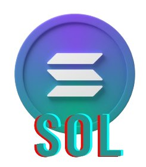
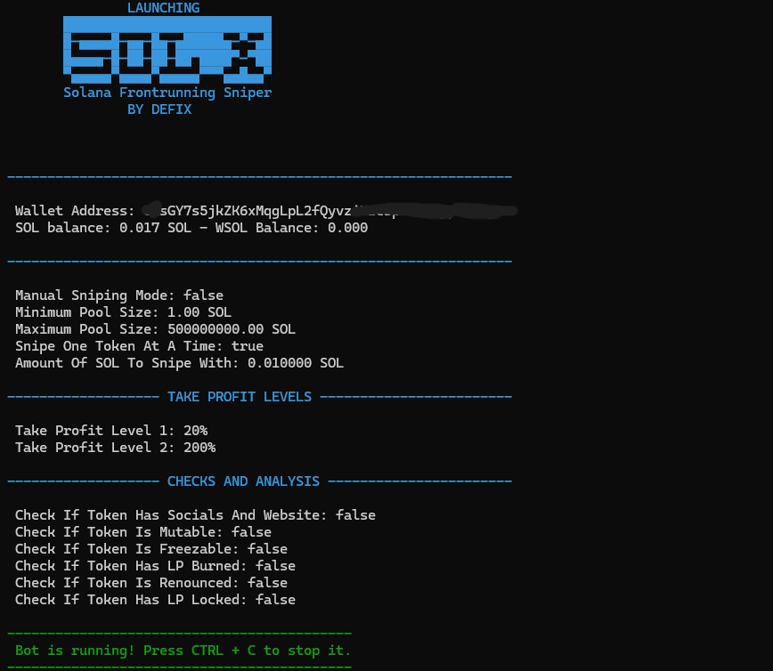

<div align="center">
  
  <h1>SOLX</h1>
  <h2>Solana V6 Auto/Manual Sniper</h2>
  <p>Free V6 sniper trial from DeFiX Labs</p>
  
  
<p align="center">
  
  
</p>

  
  
  [](https://opencollective.com/fakerjs#section-contributors)
  [](https://opencollective.com/fakerjs)
  
</div>



## 🚀 Features

- 💌 Auto approve AND Auto Snipe (Limited in Free)
- ⏰ Buys and Sells instantly using sandwich strategy vector
- 🌏 Sell tokens with your custom increase in price, like 50%, 100%, 200%.
- 💸 Contains Stop loss, trailing stop loss, 2 take profit levels and 7 filters
- 💸 Open source (Literally don't have to pay me anything to run this bot), but if you like it buy the premium version on defix.shop
- Enjoy and leave a star, if you like it!

> **Note**: Please install a code visual tool first such as Visual Studio Code as it will help you set up this bot within 5 minutes

## 📦 Install

OPTION 1, Buy the Premium bot with executable GUI here:
  
  [](https://defix.shop/product/solana-sniping-bot-ultimate/)
  
OPTION 2 for Linux, Windows and Mac users that want to run the free code:
  
1. Download nodejs for your PC from nodejs.org

2. Open terminal in the bot folder and type 

```
npm install
```
 this will install all modules required to run the bot - Fill your private key and node in variables file
 
3. double click start.bat for windows users, or start.sh for mac after making it executable

4. If you want to run in terminal
```
node buy.js
```


## 📝 Changelog

Detailed changes for each release:

#### • Version v1 [New Interface] - 1 week ago

## 🔑 License

[MIT]
